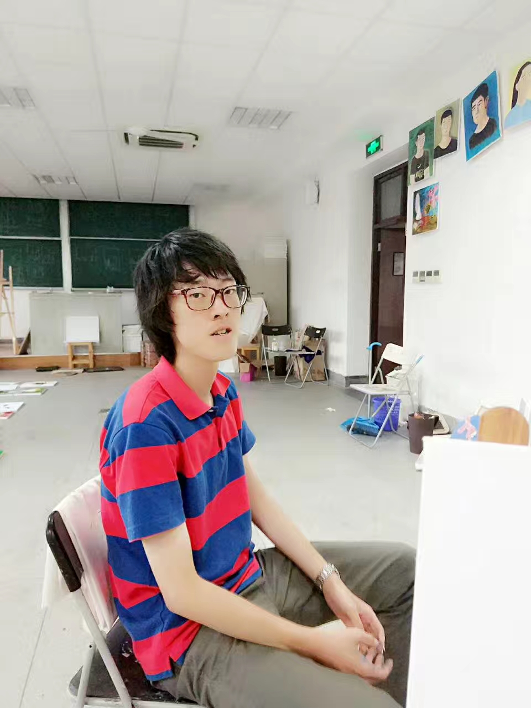

## About Me

Hi, I'm Yi Cui. I am a senior(4th) year undergraduate student in Fudan University, China, majored in Economics. 

 

## Research Interest

My research interests mainly lie on Economics Research combined with Data Science. My current research focus is mainly on Mechanism Design, Asset Portfolio and Microeconomic Theory. 

> While all of these areas are easy to start with, it is quite complicated to further digest and do research. Previous efforts may push us towards ultimate goal.
> - With the confusing actual problems, how to solve these questions remains unknown.
> - Structual modeling of problem, complex relationships and simulation processes in the structure of the models.
>
> And I am on the way of these explorations and I have reach some achievements.

## Education

<b>Fudan University,</b> 2015.9 - 2017.6  <b>Mechanical Engineering</b>

<b>Fudan University,</b> 2017.6 - 2020.6  <b>Economics</b>

<b>Fudan University,</b> 2017.6 - 2020.6  <b>Data Science</b> (Minor)

<b>University of California, Los Angeles</b>, 2017.8 - 2017.12

## Conference

1. The Eighth China Youth Economic Forum, Peking University, Beijing, P.R. China. 

   May 2019

2. The Seventh SIIFC International Forum, Shanghai, P.R. China. 

   April 2019

   Paper: The Impact of Green Credit on the Development of Regional Industrial Structure

    [SIIFC Slides 2019](https://cymichael.github.io/resources/SIIFC_Yi_Cui_2019.pdf)

## Patents

[Details about Patents](https://cymichael.github.io/resources/patent_details.html)

1. National Patent-S, First Inventor, ***Yi Cui***, 2018

   Application Number/Patent Number: 201821803958.4

2. National Patent-F, First Inventor, ***Yi Cui***, 2018

   Application Number/Patent Number: 201811304193.4

## Teaching Assistant

1. Macroeconomics (EMAE620005.01)

   - [Prof. Shi Qiu](https://econ.fudan.edu.cn/sdpzw-con.jsp?urltype=news.NewsContentUrl&wbtreeid=1658&wbnewsid=14745), School of Economics, Fudan University

   - [Syllabus](https://cymichael.github.io/resources/EMA_Macro_Syllabus.pdf), From Feb. 2020 to Jun. 2020 [Spring]

   - <u>Graduate Level</u>

     See more resources on the e-learning system (**Canvas**).

2. Principle of microeconomics (SOSC120020.01)

   - [Prof. Yu Liu](https://sites.google.com/site/yuliu2014/home), School of Economics, Fudan University

   - [Syllabus](https://cymichael.github.io/resources/Principles_of_microeconomics_syllabus_2019.pdf), From Sep. 2019 to Jan. 2020 [Autumn]

   - <u>Undergraduate Level</u>

     See more resources on the e-learning system (**Canvas**).

3. Econometrics (EMAE620009.01)

   - [Prof. Huailu Li](https://huailuli.weebly.com/), School of Economics, Fudan University

   - [Syllabus](https://cymichael.github.io/resources/EMA_Econometrics_Syllabus.pdf), From Sep. 2019 to Dec. 2019 [Autumn]

   - <u>Graduate Level</u>

     See more resources on the e-learning system (**Canvas**).

## Research & Interns

1. [Junior Research Assistant](https://aims.cuhk.edu.hk/converis/portal/Person/97321951?auxfun=&lang=zh_HK), From Jul. 2019 to Sep. 2019

   - Advisor: [Prof. Jimmy Chan](https://jimmyhingchan.weebly.com/), School of Economics, The Chinese University of Hong Kong

     [Presentation Slides 2019](https://cymichael.github.io/resources/Summer_Final_Pre_YiCui.pdf)
     
     Mechanism design, microeconomic theory, game theory.
     
     Solving an auction problem about land redevelopment, finishing several simulations by using MATLAB. 

2. Research Assistant, From Apr. 2018 to Jun. 2020 [*Xi yuan Program*]

   - Advisor:  [Prof. Xiao Wei](https://econ.fudan.edu.cn/sdpzw-con.jsp?urltype=news.NewsContentUrl&wbtreeid=1658&wbnewsid=14152), School of Economics, Fudan University, Coordinator: Jingyan Zhang

     [Presentation Slides 2018](https://cymichael.github.io/resources/Dynamic_hedging_Yi_Cui.pdf)
     
     Using the Kreps-Porteus model based on the expected utility model to conduct in-depth research on the dynamic hedging phenomenon. 

3. Research Assistant, From Jul. 2017 to Dec. 2017

   - Advisor: [Prof. Wotao Yin](http://www.math.ucla.edu/~wotaoyin/), [Dr. Fei Feng](http://www.math.ucla.edu/~fei.feng/), School of Mathematics, University of California, Los Angeles

     [Presentation Slides 2017](https://cymichael.github.io/resources/Reinforcement_learning.pdf)

     Reinforcement learning, value iteration, linear optimization.
     
     Learning sequential markov decision process and related optimization problems and solving the algorithm advancement project in collaboration with Ph.D. Fei Feng, University of California, Los Angeles. 

4. Research Assistant, From Feb. 2016 to Aug. 2018 [*Xi yuan Program*]

   - Advisor: [Prof. Shuyu Zhang](http://www.it.fudan.edu.cn/data/view/1187), School of Electronic Engineering, Fudan University

     <b>Tengfei Scientific Innovation Group, Xi Yuan Program</b>, School of **Electronic Engineering**

     Combining light emitting module, the light receiving module, the light processing module and the data analysis application software to realize the health detecting function.

     [Project Approval](http://www.fdcollege.fudan.edu.cn/tfcollege/98/f8/c7550a104696/page.htm)

     [Medium Oral Defense](https://mp.weixin.qq.com/s/K2EBv3vt8iOUlw4TRHK4Rg)

     [Project Result](https://mp.weixin.qq.com/s/aCEUwctWMN2SiWNSwq9tDQ)
     
     [Outstanding Tengfei Award](http://www.fdcollege.fudan.edu.cn/_upload/article/files/37/cb/ff787aee4a29afd56aeefb8ccce2/59594abd-692e-4383-ae25-858c6ff87fbb.pdf)

## Publications

1. Incoming

## Projects
- GitHub Eye: 
    - [GitHub Eye, Hack × FDU 2016](https://github.com/cyMichael/GithubEye)
- Flipped
    - [Flipped, Hack × STJ 2017](https://github.com/cyMichael/Flipped-1)
- Softwares: 
    - Incoming
- National Mathematical Model Contest 2017:
    - [Codes for Contest](https://github.com/cyMichael/Mathematical-Modeling-of-2017)
- MCM/ICM 2018:
    - [Paper](https://cymichael.github.io/resources/87843_2018MCM_YiCui.pdf)
- Codes for Papers:
    - Incoming
- Blogs:
  - Incoming
- UCLA MAE 271A Project(PhD level):
  - [Project Paper(95/100) Top 3%](https://cymichael.github.io/resources/Final_Project_UCLA_MAE271A.pdf)

- Project(Fudan University, 2018 Fall)
  - [Thesis Proposal](https://cyMichael.github.io/resources/Thesis_Proposal.pdf)

## Paper for Mathematical Contest

1. [2017_MCM](https://cymichael.github.io/resources/55238_2017MCM_YiCui.pdf)

2. [2018_MCM](https://cymichael.github.io/resources/87843_2018MCM_YiCui.pdf)

3. [2016_National_Contest]()

4. [2017_National_Contest](https://cymichael.github.io/resources/A201709001057_National_YiCui_2017.pdf)

5. [2018_National_Contest](https://cymichael.github.io/resources/A201809001088_National_YiCui_2018.pdf)

*. [Problem Sets of National Contest(2016-2018)](https://cymichael.github.io/resources/National Mathematical Contest Problems(2016-2018).pdf)

## Honors

- [National Mathematics Model Contest, Second Prize, 2016](http://www.fdcollege.fudan.edu.cn/b5/9e/c9395a112030/page.htm)
- [National Mathematics Model Contest, Third Prize, 2017](http://www.jwc.fudan.edu.cn/13/20/c9395a135968/page.htm)
- [MCM/ICM Honor Prize, 2018](https://cymichael.github.io/resources/A201809001088_National_YiCui_2018.pdf)
- [MCM/ICM Third Prize, 2017](55238_2017MCM.pdf)
- [Xi Yuan Program: Outstanding](http://www.fdurop.fudan.edu.cn/projDetail.php?gk=6235&sk=7303&st=3)
- [Assistant Counselor, Fudan University, 2017](http://www.stuaff.fudan.edu.cn/cf/b6/c10070a118710/page.htm)
- [Tengfei Award, No. 1st](http://www.fdcollege.fudan.edu.cn/_upload/article/files/37/cb/ff787aee4a29afd56aeefb8ccce2/59594abd-692e-4383-ae25-858c6ff87fbb.pdf)

## Advice

- [Linear Algebra, Fudan Math Department](https://www.cnblogs.com/torsor/p/10292081.html)

## Abilities

- Proficient: Python, PyTorch, MATLAB, AutoCAD
- Skilled: STATA, C++, Tensorflow, Web/Android Development
- Independent research ability
- English
   

