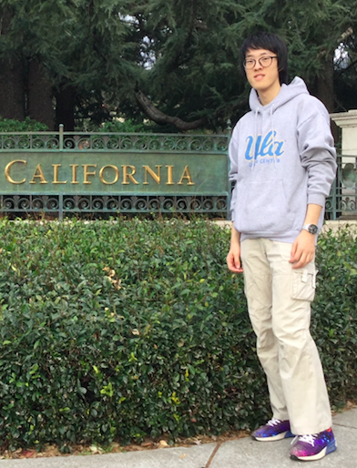

## About Me

Hi, I'm Yi Cui. I am a junior(3rd) year undergraduate student in Fudan University, China, majored in Economics. 

 

## Research Interest

My research interests mainly lie on Economics Research combined with Data Science. My current research focus is mainly on Asset Portfolio and Microeconomic Theory. 

> While both of areas are easy to start with, it is quite complicated to further digest and do research . Previous efforts may push us towards ultimate goal.
> - With the confusing actual problems, how to solve these questions remains unknown.
> - Structual modeling of problem, complex relationships and simulation processes in the structure of the models.
>
> And I am on the way of these explorations and I have reach some achievements. [Xi Yuan 2016](http://www.fdurop.fudan.edu.cn/projDetail.php?gk=6235&sk=7303&st=3) , [Xi Yuan 2018](http://www.fdurop.fudan.edu.cn/projDetail.php?gk=6818&sk=7303&st=1)

## Education

<b>Fudan University,</b> 2015.9 - 2017.6  <b>Mechanical Engineering</b>

<b>Fudan University,</b> 2017.6 - 2020.6  <b>Economics</b>

<b>Fudan University,</b> 2017.6 - 2020.6  <b>Data Science</b> (Minor)

<b>University of California, Los Angeles</b>, 2017.8 - 2017.12

## Patent

1. National Patent-S, First Inventor, ***Yi Cui***, 2018

   Application Number/Patent Number: 201821803958.4

2. National Patent-F, First Inventor, ***Yi Cui***, 2018

   Application Number/Patent Number: 201811304193.4

## Research & Interns

---

<b>Tengfei Scientific Innovation Group, Xi Yuan Program</b>, School of **Electronic Engineering**

Research Assistant, From Feb. 2016 to Aug. 2018

- Advisor: [Prof. Shuyu Zhang](http://www.it.fudan.edu.cn/data/view/1187), Fudan University

OLED, New Organic Semiconductors, Perovskite Quantum Dots, Photonic Crystals, Visible Light Communication, <b>[etc.](http://www.it.fudan.edu.cn/En/Data/View/1961)</b> 

[Project Approval](http://www.fdcollege.fudan.edu.cn/tfcollege/98/f8/c7550a104696/page.htm)

[Medium Oral Defense](https://mp.weixin.qq.com/s/K2EBv3vt8iOUlw4TRHK4Rg)

[Project Result](https://mp.weixin.qq.com/s/aCEUwctWMN2SiWNSwq9tDQ)

[Outstanding Tengfei Award](http://www.fdcollege.fudan.edu.cn/_upload/article/files/37/cb/ff787aee4a29afd56aeefb8ccce2/59594abd-692e-4383-ae25-858c6ff87fbb.pdf)

Research Assistant, From Apr. 2018 to Present

- Advisor:  [Prof. Xiao Wei](http://www.econ.fudan.edu.cn/teacherdetail.php?tid=209), Fudan University, Coordinator: Jingyan Zhang

The study of microeconomic theory. His research topics include undecided equity theory, preference change theory, and utility function theory in uncertain environments, <b>[etc.](http://www.econ.fudan.edu.cn/teacherdetail.php?tid=209)</b>

Research Assistant, From Jul. 2017 to Jul. 2018
- Advisor: [Prof. Wotao Yin](http://www.math.ucla.edu/~wotaoyin/), [Dr. Fei Feng](http://www.math.ucla.edu/~fei.feng/)

<b>[UCLA Math](https://www.math.ucla.edu)</b>, Los Angeles, United States

An applied mathematician and professor in the Mathematics department at the University of California, Los Angeles in Los Angeles, California. He currently conducts research in optimization, parallel and distributed computing, and inverse problems, <b>[etc.](https://en.wikipedia.org/wiki/Wotao_Yin)</b>

## Publications

1. Incoming

## Projects
- GitHub Eye: 
    - [GitHub Eye, Hack × FDU 2016](https://github.com/cyMichael/GithubEye)
- Flipped
    - [Flipped, Hack × STJ 2017](https://github.com/cyMichael/Flipped-1)
- Softwares: 
    - Incoming
- National Mathematical Model Contest 2017:
    - [Codes for Contest](https://github.com/cyMichael/Mathematical-Modeling-of-2017)
- MCM/ICM 2018:
    - [Paper](https://cymichael.github.io/resources/87843_2018MCM_YiCui.pdf)
- Codes for Papers:
    - Incoming
- Blogs:
  - Incoming
- UCLA MAE 271A Project(PhD level):
  - [Project Paper(95/100) Top 3%](https://cymichael.github.io/resources/Final_Project_UCLA_MAE271A.pdf)

- Project(Fudan University, 2018 Fall)
  - [Thesis Proposal](https://cyMichael.github.io/resources/Thesis_Proposal.pdf)

## Paper for Mathematical Contest

1. [2017_MCM](https://cymichael.github.io/resources/55238_2017MCM_YiCui.pdf)

2. [2018_MCM](https://cymichael.github.io/resources/87843_2018MCM_YiCui.pdf)

3. [2016_National_Contest]()

4. [2017_National_Contest](https://cymichael.github.io/resources/A201709001057_National_YiCui_2017.pdf)

5. [2018_National_Contest](https://cymichael.github.io/resources/A201809001088_National_YiCui_2018.pdf)

## Honors

- [National Mathematics Model Contest, Second Prize, 2016](http://www.fdcollege.fudan.edu.cn/b5/9e/c9395a112030/page.htm)
- [National Mathematics Model Contest, Third Prize, 2017](http://www.jwc.fudan.edu.cn/13/20/c9395a135968/page.htm)
- [MCM/ICM Honor Prize, 2018](https://cymichael.github.io/resources/A201809001088_National_YiCui_2018.pdf)
- [MCM/ICM Third Prize, 2017](55238_2017MCM.pdf)
- [Xi Yuan Program: Outstanding](http://www.fdurop.fudan.edu.cn/projDetail.php?gk=6235&sk=7303&st=3)
- [Assistant Counselor, Fudan University, 2017](http://www.stuaff.fudan.edu.cn/cf/b6/c10070a118710/page.htm)
- [Tengfei Award, No. 1st](http://www.fdcollege.fudan.edu.cn/_upload/article/files/37/cb/ff787aee4a29afd56aeefb8ccce2/59594abd-692e-4383-ae25-858c6ff87fbb.pdf)

## Advice

- [Linear Algebra](https://www.cnblogs.com/torsor/p/10292081.html)

## Abilities

- Proficient: Python, PyTorch
- Skilled: MATLAB, STATA, C++, Tensorflow, Web/Android Development
- Independent research ability
- English
   
