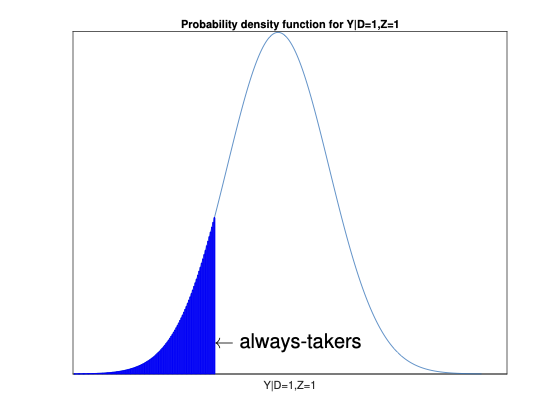
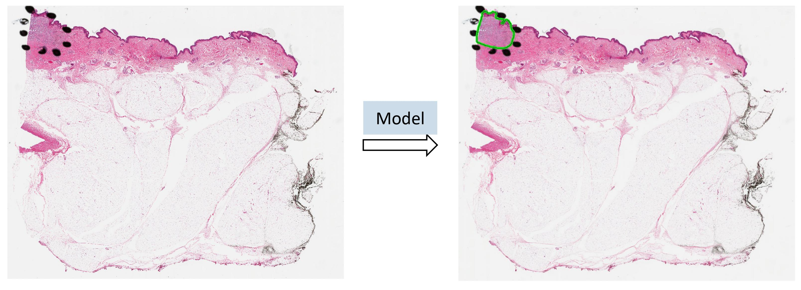
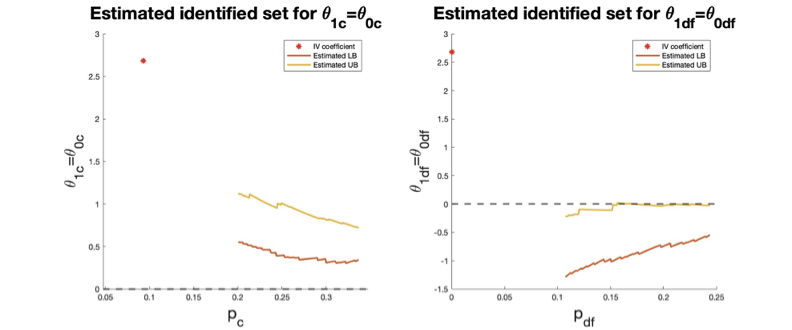

# Research & Publications

### [Three Essays on Robust Identification in Heterogeneous Treatment Effects Models](https://www.proquest.com/openview/7a6f6880726ff701684752b1a73e1ee0/1?pq-origsite=gscholar&cbl=18750&diss=y)
*Dissertation (2025)*  
**Yi Cui**  

---

### [Region of Interest Detection in Melanocytic Skin Tumor Whole Slide Images—Nevus and Melanoma](https://www.mdpi.com/2072-6694/16/15/2616)
*Published in Cancers (MDPI) / Accepted by NeurIPS 2022*  
**Yi Cui, et al.**  

---

### [Robust Identification in Randomized Experiments with Noncompliance](https://arxiv.org/abs/2408.03530)
*Working Paper (2024)*  
**Yi Cui**  

  

[View Google Scholar Profile](https://scholar.google.com/citations?user=HLJKLKIAAAAJ&hl=en)
